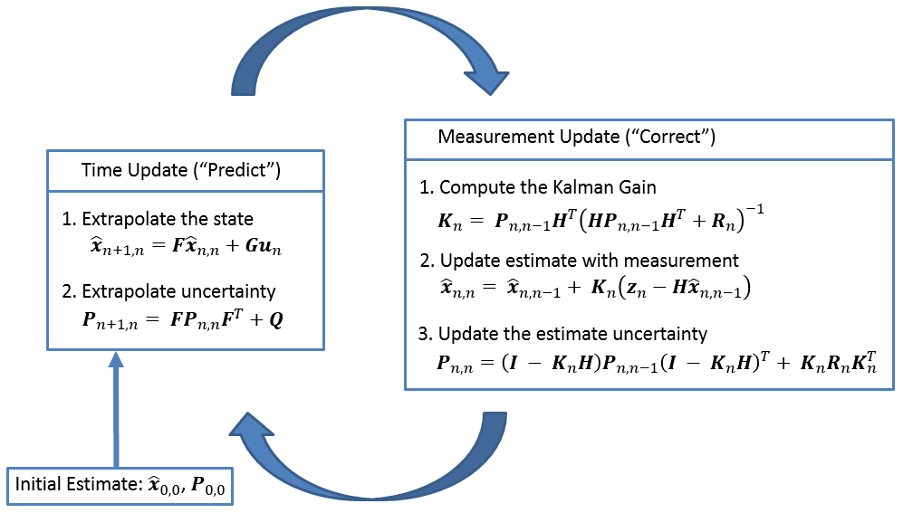
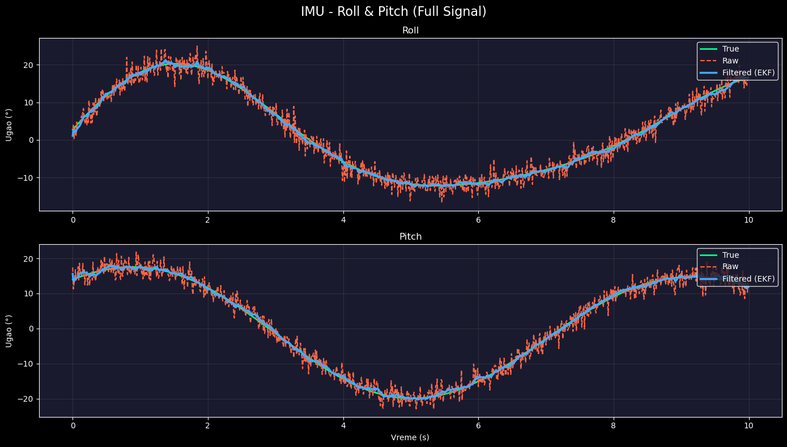

# STM32 IMU Extended Kalman Filter (EKF)

## Overview

This project implements a **6-DOF IMU orientation estimation** using an **Extended Kalman Filter (EKF)**. The filter fuses data from a **3-axis gyroscope** and a **3-axis accelerometer** to estimate **Roll and Pitch angles** in real-time.

The firmware is written in **C** and tested on **STM32F3**, but the core EKF and matrix math libraries are **platform-independent** and can be easily ported to any microcontroller (Arduino, ESP32, etc.). Code is commented step by step so someone who didn't implement EKF can learn.
---

## How It Works

Below is the block diagram of the Extended Kalman Filter algorithm used in this project:

### System Model
The EKF tracks a **6-state vector**:
x = [roll, pitch, yaw, bias_x, bias_y, bias_z]

- **roll, pitch, yaw** – orientation angles (radians)
- **bias_x, bias_y, bias_z** – gyroscope biases (rad/s) to compensate for drift

### Filter Phases
1. **Prediction (Gyroscope)** – integrates angular velocity to predict new angles
2. **Correction (Accelerometer)** – corrects drift using gravity vector measurement

### Why Extended Kalman Filter?
- Standard Kalman filter assumes linear systems
- Accelerometer measurement model uses **sin/cos** (nonlinear)
- EKF linearizes the measurement model using a **Jacobian matrix**

---

##  Results

**What you see:**
- **Green** = True angle (ground truth)
- **Red dashed** = Raw angle from accelerometer (noisy)
- **Blue** = EKF filtered output (smooth, accurate)

---

### Simulation & Visualization (Python)
- **NumPy** – data generation
- **Matplotlib** – plotting
- **PySerial** – UART communication

